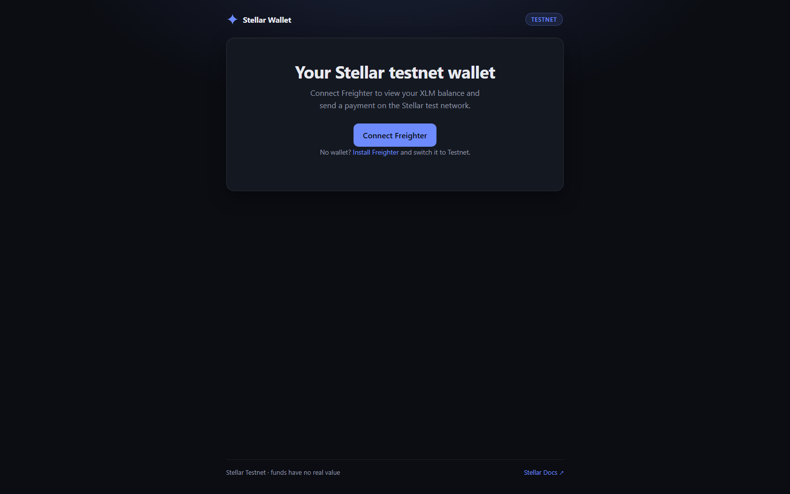

# Stellar Testnet Wallet

A minimal, production-quality **Stellar testnet wallet**: connect the **Freighter** browser wallet, view your **XLM balance**, and **send an XLM payment** on the Stellar **Testnet**, with clear transaction feedback and a link to the block explorer.

Built for the Rise In *Stellar Journey to Mastery*, Level 1 (White Belt) challenge.

> ⚠️ **Testnet only.** This app talks to the Stellar **test network**. Testnet XLM has **no real value**.

## Features

- 🔌 **Connect / disconnect** the Freighter wallet (raw `@stellar/freighter-api`).
- 🌐 **Network guard**: reads the wallet's network and requires **Testnet** before sending.
- 💰 **Balance**: fetches and displays the connected account's native XLM balance, with manual refresh.
- 🚰 **Friendbot**: one click funds a brand-new testnet account (~10,000 XLM).
- 📤 **Send XLM**: builds, signs (inside Freighter), and submits a payment, with client-side validation.
- ✅ **Transaction feedback**: success / failure state, the transaction **hash**, and a **Stellar Expert** link.
- 🛡️ **Readable errors**: decodes Horizon result codes (e.g. `op_no_destination`, `op_underfunded`).

## Tech stack

| Layer | Choice |
| --- | --- |
| Framework | React 19 + Vite + TypeScript |
| Wallet | `@stellar/freighter-api` |
| Chain | `@stellar/stellar-sdk` (Horizon testnet) |

## Quick start

**Prerequisites:** Node 18+ and the [Freighter](https://www.freighter.app/) browser extension, switched to **Testnet**.

```bash
npm install
npm run dev      # http://localhost:5173
```

1. Open the app and click **Connect Freighter**.
2. If the account is brand new, click **Fund with Friendbot** to receive testnet XLM.
3. Enter a recipient `G...` address and an amount, then **Send payment**.
4. Approve in Freighter. On success the transaction hash and a Stellar Expert link appear.

Production build:

```bash
npm run build && npm run preview
```

## How it works

- [`src/lib/stellar.ts`](src/lib/stellar.ts): all chain and wallet logic. Freighter connect, silent restore, network read, and signing; Horizon balance fetch; payment build, sign, and submit; Friendbot funding; and Horizon error decoding.
- [`src/App.tsx`](src/App.tsx): the UI and state (connect, balance, send form, transaction status).

The private key never leaves Freighter: the app builds an **unsigned** transaction (XDR), Freighter signs it, and the app submits the **signed** envelope to Horizon.

## Screenshots

| Connect | Connected + balance | Send confirmed |
| --- | --- | --- |
|  |  |  |

## License

MIT
